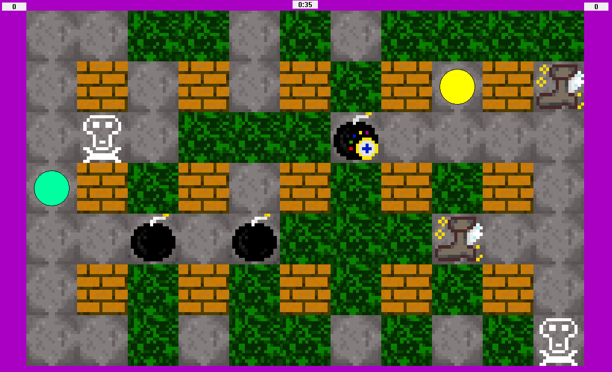

# Игра "Бомбер" для двух человек (Графическое, Windows)

## Основная информация

### Стек технологий разработки

1. Visual Studio 2019: C++, Win API.

### Фото геймплея

### Управление
&emsp;После нажатий на клавиши движений, движеий записываются в буффер и ваш персонаж постепенно движется по ним. 

|Игрок|Движение|Поставить бомбу|Очистить буфер движений|
|-|-|-|-|
|Первый|стрелочки (arrows)|ввод (enter)|\\ |
|Второй|WASD|пробел (space)|C|

## Дата

&emsp;&emsp;Лето 2022г.

## Заключение

&emsp;&emsp;Это довольно весело! Попробуйте.

 ${\color{yellow}TODO}$ 1) поменять цвет или формат фона.\
 ${\color{yellow}TODO}$ 2) добавить фотки игроков (не олучается сделать изображения игрков прозрачными).